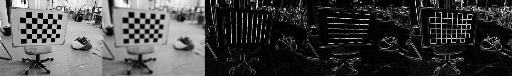
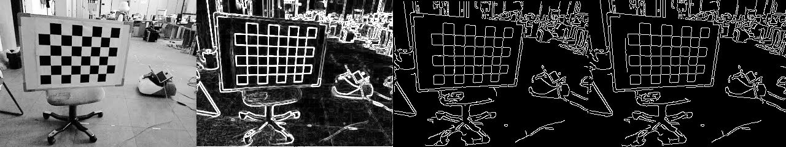
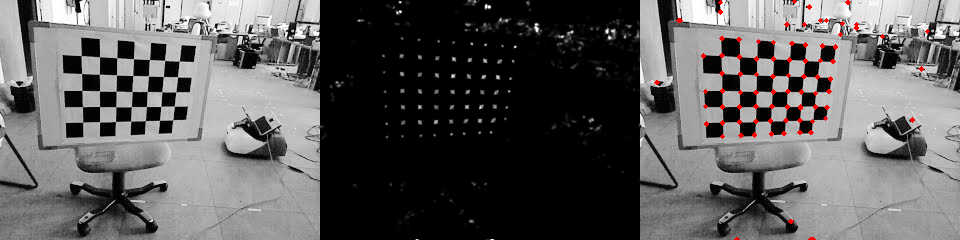
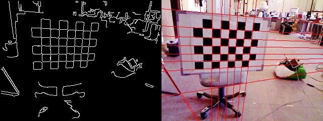
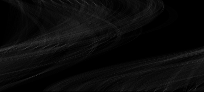
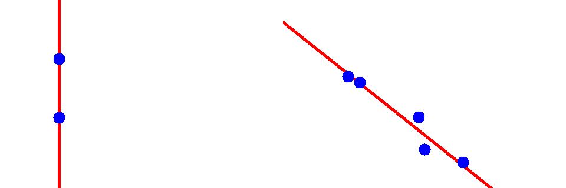
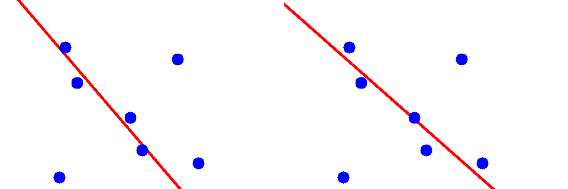

cpp_practice_image_processing
===============================

**Contents:**
* Sobel filter.
* Canny edge detection.
* Harris keypoints detection.
* Hough line detection.
* Fit 2D line with/without RANSAC.


# Usage

Environment: Ubuntu18.  
Dependencies: `OpenCV` and `eigen3`. 

**Main commands:**
```
mkdir -p build bin lib output
cd build; cmake ..; make -j7; cd ..

bin/test_sobel_and_gaussion
bin/test_canny
bin/test_harris
bin/test_hough_line
bin/test_fit_2d_line
bin/test_ransac_fit_2d_line
```

# Results

[tests/test_sobel_and_gaussion.cpp](tests/test_sobel_and_gaussion.cpp)
(1. Src; 2. Gaussion; 3. SobelX; 4. SobelY; 5.Sobel.)


[tests/test_canny.cpp](tests/test_canny.cpp)
(1. Src; 2. Sobel; 3. Canny(Mine); 4. Canny(OpenCV).)


[tests/test_harris.cpp](tests/test_harris.cpp)
(1. Src; 2. Corner response; 3. Corners.)


[tests/test_hough_line.cpp](tests/test_hough_line.cpp)
(1. Sobel; 2. Lines; 3. Hough transform.)



[tests/test_fit_2d_line.cpp](tests/test_fit_2d_line.cpp)
(1. Fit two points; 2. Fit five points.)



[tests/test_ransac_fit_2d_line.cpp](tests/test_ransac_fit_2d_line.cpp)
(Sample x points to fit the initial line parmeters: x=2 & x=4.)

